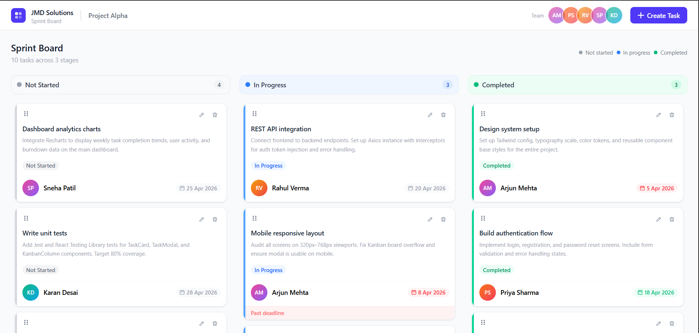
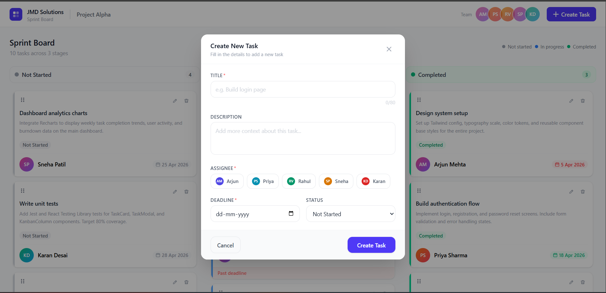
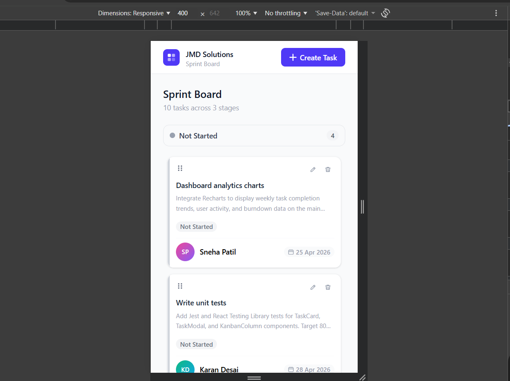

# JMD Sprint Board — Jira-like Task Management App

A modern, fully interactive Kanban board built with React. Supports drag-and-drop task management, animated interactions, and a clean corporate UI — built as part of the JMD Solutions & Beyond frontend assessment.

---

## Live Demo

[Click here to view the app](https://jira-clone-gules.vercel.app)

---

## Screenshots

### Kanban Board


### Create Task Modal


### Mobile View


---

## Features

- **Kanban Board** — 3-column layout: Not Started, In Progress, Completed
- **Drag & Drop** — move tasks between columns and reorder within columns using dnd-kit
- **Create Tasks** — modal form with title, description, assignee, deadline, and status
- **Edit Tasks** — click any card or the edit icon to update task details
- **Delete Tasks** — trash icon on hover opens a confirmation dialog before deleting
- **Overdue Detection** — tasks past their deadline show a red "Past deadline" strip automatically
- **Assignee Management** — 5 mock users with colored avatars, selectable via visual picker
- **Animations** — Framer Motion powers card enter/exit, modal open/close, hover effects, and micro-interactions
- **Responsive Layout** — single column on mobile, 3-column grid on desktop
- **Form Validation** — title, assignee, and deadline are required with inline error messages
- **Drag Overlay** — ghost card with slight rotation follows cursor while dragging
- **Assignee Filter** — click any team avatar in the header to filter tasks by that person across all columns; click again to clear the filter

---

## Tech Stack

| Technology | Purpose |
|---|---|
| React 18 | UI framework |
| Vite | Build tool and dev server |
| Tailwind CSS v4 | Utility-first styling |
| Framer Motion | Animations and micro-interactions |
| dnd-kit | Drag and drop |
| Context API + useReducer | Global state management |

---

## Project Structure

```
jira-clone/
├── Screenshots/
│   ├── board.png
│   ├── create-task.png
│   └── mobile.png
├── src/
│   ├── components/
│   │   ├── DeleteDialog.jsx
│   │   ├── Header.jsx
│   │   ├── KanbanBoard.jsx
│   │   ├── KanbanColumn.jsx
│   │   ├── TaskCard.jsx
│   │   ├── TaskModal.jsx
│   │   └── UserAvatar.jsx
│   ├── context/
│   │   └── TaskContext.jsx
│   ├── data/
│   │   └── mockData.js
│   ├── hooks/
│   │   └── useTasks.js
│   ├── App.css
│   ├── App.jsx
│   ├── index.css
│   └── main.jsx
├── .gitignore
├── eslint.config.js
├── index.html
├── package-lock.json
├── package.json
├── postcss.config.js
├── README.md
├── tailwind.config.js
└── vite.config.js
```

## Getting Started

### Prerequisites

- Node.js v18 or higher
- npm v9 or higher

### Installation

```bash
# 1. Clone the repository
git clone https://github.com/Sakshic29/jira-clone.git
cd jira-clone

# 2. Install dependencies
npm install

# 3. Start the development server
npm run dev
```

Open [http://localhost:5173](http://localhost:5173) in your browser.

### Build for Production

```bash
npm run build
```

The output will be in the `dist/` folder, ready to deploy.

---

## State Management

Global state is handled with React's built-in `useReducer` inside a `TaskContext` provider. No external state library is needed.

### Available actions

| Action | Description |
|---|---|
| `ADD_TASK` | Creates a new task with a generated ID |
| `UPDATE_TASK` | Updates any fields on an existing task |
| `DELETE_TASK` | Removes a task by ID |
| `MOVE_TASK` | Moves a task to a different column (status change) |
| `REORDER_TASK` | Reorders a task within the same column |

### Context helpers

| Helper | Description |
|---|---|
| `getTasksByStatus(status)` | Returns filtered tasks for a given column |
| `getUserById(id)` | Looks up a user object by ID |
| `isOverdue(deadline)` | Returns true if deadline is before today (timezone-safe) |
| `filterUserId` | Currently active assignee filter (null = show all) |
| `setFilterUserId(id)` | Sets or clears the assignee filter |

---

## Mock Data

The app ships with 5 mock users and 10 pre-loaded tasks spread across all three columns. Some tasks are intentionally set to past deadlines to demonstrate the overdue indicator.

**Mock users:** Arjun Mehta, Priya Sharma, Rahul Verma, Sneha Patil, Karan Desai

---

## Deployment (Vercel)

```bash
# 1. Push your project to a GitHub repository

# 2. Go to https://vercel.com and click "New Project"

# 3. Import your GitHub repository

# 4. Leave all settings as default — Vercel auto-detects Vite

# 5. Click Deploy
```

Your live URL will be ready in about 60 seconds.

---

## Assessment Requirements Checklist

| Requirement | Status |
|---|---|
| Create, update, delete tasks | Done |
| Assign tasks to users | Done |
| Track task status across 3 stages | Done |
| Handle deadlines with overdue detection | Done |
| Kanban board layout | Done |
| Modern and clean corporate UI | Done |
| Responsive across devices | Done |
| Mock multiple users with avatars | Done |
| Drag and drop between columns | Done |
| Reorder tasks within column | Done |
| Framer Motion animations | Done |
| Micro-interactions and hover effects | Done |
| React Hooks and Context API | Done |
| Tailwind CSS | Done |
| Assignee filter by avatar click | Done |

---

## Author

**Sakshi** — Frontend Developer Assessment  
JMD Solutions & Beyond — April 2026
